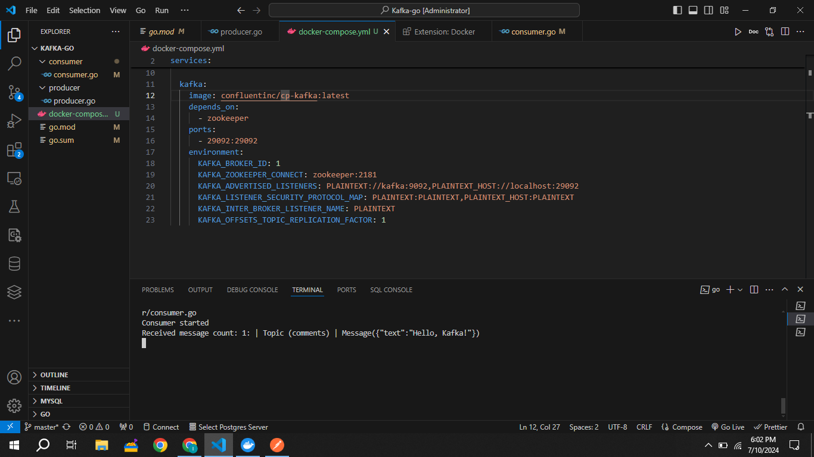

# Kafka with Golang Example

Apache Kafka is a robust distributed streaming platform that excels in handling real-time data feeds and processing. When integrated with Go, using the Sarama library by IBM emerges as one of the most reliable approaches. This library is very stable, provides a lot of functionality and can 100% be used in production (unlike other kafka libraries for GO).

It's a simple system to add a message through REST API then produce it in Apache and process it in consumer/worker. It can be any time-taking process like saving it data store and performing aggregation or some computation.

## Setup

1. ```bash
    git clone https://github.com/codeabuu/Kafka-go.git
    ```
2. Run docker-compose up -d in the root directory. This will start Apache Kafka and Zookeeper.
3. Install dependencies
4. Run go run producer/producer.go to start the producer which is a REST API listening on port 3000.
5. Run go run worker/worker.go to start the consumer.

## Tests

Send post request to localhost:3000 using postman.
This will produce a message in our kafka and consumer will process it as seen in the below images:




